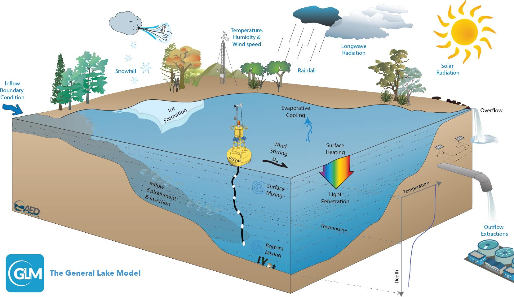

# Project: Project 2: Evaluating Physics-Guided Machine Learning Algorithms for Modeling Lake Stratification

### [Full Project Description](doc/project2_desc.md)



(Image source: https://aed.see.uwa.edu.au/research/models/glm/)

Term: Spring 2022

+ Team members
	+ Nan Zhang
	+ George Lu
	+ Charlie Sturr
	+ Bryn Stecher


+ Project summary: 

In the paper, there were various ways the model was tested, including, but not limited to: restricting the training data to certain months, restricting the training data by size, and extending the model to other lake systems. As we saw, the model’s RMSE was significantly reduced across all testing schemas. However, LSTM models can become especially computationally heavy as layers, epochs, and data set sizes increase. So we'd like to improve the original model so that our new model would have faster speed while keeping a good performance. Based on this idea, a new evaluation method -- computation speed -- is introduced in our project.

Another way to speed up/simplify the model is to train it on less data. One novel approach we took to do this was to train models with while neglecting the lower depths. We then want to observe to see if our depth-limited model can capture the whole depth profile as well as the original while only being trained with a piece of it.

To achieve our goal, we planed to modify the original model in two directions and finally combine them together. One is to adjust the optimizer in the machine learning model, another is to find an optimal partial training depth that still allows for the capturing of the entire depth profile in its predictions.
+ 	
**Contribution statement**: All team members contributed equally in all stages of this project. All team members approve our work presented in this GitHub repository including this contributions statement. 

Following [suggestions](http://nicercode.github.io/blog/2013-04-05-projects/) by [RICH FITZJOHN](http://nicercode.github.io/about/#Team) (@richfitz). This folder is orgarnized as follows.

```
proj/
├── lib/
├── data/
├── doc/
├── figs/
└── output/
```

Please see each subfolder for a README file.
